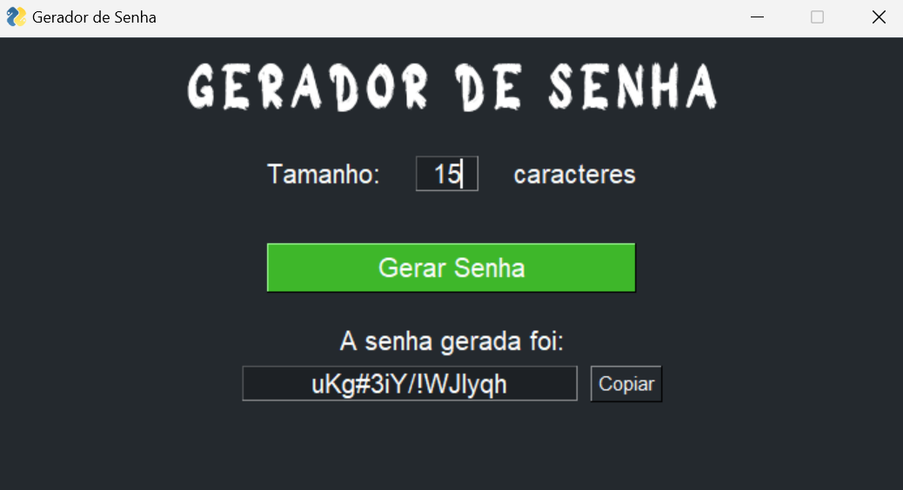

# Gerador de Senha

### Sobre o projeto

Este projeto tem como objetivo sugerir senhas de acordo com a quantidade de caracteres informado pelo usuário.

### Tecnologias

1. Linguagem de programação

    * Python 3.11.2

2. Bibliotecas

    * random
    * string
    * pyperclip
    * PySimpleGUI

